<!-- ═══════════════════════════════════════════════════════════════ -->
<!--  HEADER : Waving gradient banner                                 -->
<!-- ═══════════════════════════════════════════════════════════════ -->

<!-- System status bar -->

  

<!-- Typing animation -->

 

<!-- Terminal card (local SVG in ./assets) -->

 

<!-- ═══════════════════════════════════════════════════════════════ -->
<!--  ARCHITECTURE PIPELINE                                           -->
<!-- ═══════════════════════════════════════════════════════════════ -->

 

<!-- ═══════════════════════════════════════════════════════════════ -->
<!--  CORE COMPETENCIES                                               -->
<!-- ═══════════════════════════════════════════════════════════════ -->
<h2 align="center">⚡ Core Engineering Principles</h2>

<table align="center" width="100%">
<tr>
<td width="33%" align="center" valign="top">
<h3>🚀 Performance First</h3>
Optimized rendering pipelines, sub-50ms API responses, lazy loading, code splitting, and aggressive edge caching.
</td>
<td width="33%" align="center" valign="top">
<h3>🛡️ Resilient Systems</h3>
Fault-tolerant services, circuit-breaking patterns, event-driven decoupling with async queues, and ACID transactional integrity.
</td>
<td width="33%" align="center" valign="top">
<h3>🧩 Clean Architecture</h3>
Domain-driven design, strictly typed contracts with TypeScript, self-documenting APIs, and modular components.
</td>
</tr>
</table>

 

<!-- ═══════════════════════════════════════════════════════════════ -->
<!--  TECH STACK                                                      -->
<!-- ═══════════════════════════════════════════════════════════════ -->
<h2 align="center">🛠️ Technology Arsenal</h2>

<table align="center" width="100%">
<tr>
<td width="50%" align="center" valign="top">
<h3>🎨 Frontend & Interactive</h3>

 React • Next.js • TypeScript • Three.js • Tailwind CSS • Framer Motion
</td>
<td width="50%" align="center" valign="top">
<h3>⚙️ Backend & APIs</h3>

 Node.js • Express • NestJS • REST • GraphQL • WebSockets • Microservices
</td>
</tr>
<tr>
<td width="50%" align="center" valign="top">
<h3>🗄️ Data Persistence & Caching</h3>

 PostgreSQL • MySQL • Redis • MongoDB • Firebase • Prisma / TypeORM
</td>
<td width="50%" align="center" valign="top">
<h3>☁️ Mobile, DevOps & Cloud</h3>

 Docker • Kubernetes • AWS • GitHub Actions CI/CD • Linux • Vercel • Postman
</td>
</tr>
</table>

 

<!-- ═══════════════════════════════════════════════════════════════ -->
<!--  GITHUB STATS                                                    -->
<!-- ═══════════════════════════════════════════════════════════════ -->
<h2 align="center">📊 Real-Time GitHub Telemetry & Velocity</h2>

  

  

 

<!-- ═══════════════════════════════════════════════════════════════ -->
<!--  CONTRIBUTION SNAKE (generated by .github/workflows/snake.yml)  -->
<!-- ═══════════════════════════════════════════════════════════════ -->

<picture>
  <source media="(prefers-color-scheme: dark)" srcset="https://raw.githubusercontent.com/Phawatcharakorn/Phawatcharakorn/output/github-contribution-grid-snake-dark.svg" />
  <source media="(prefers-color-scheme: light)" srcset="https://raw.githubusercontent.com/Phawatcharakorn/Phawatcharakorn/output/github-contribution-grid-snake.svg" />
  
</picture>

 

<!-- ═══════════════════════════════════════════════════════════════ -->
<!--  ACHIEVEMENTS / TROPHIES                                         -->
<!-- ═══════════════════════════════════════════════════════════════ -->
<h2 align="center">🏆 Verified GitHub Achievements</h2>

 

<!-- ═══════════════════════════════════════════════════════════════ -->
<!--  FEATURED PROJECTS                                               -->
<!--  ยังไม่ได้ใส่โปรเจกต์จริง — ลบคอมเมนต์ <!-- / --> ด้านล่างออก      -->
<!--  แล้วแก้ PROJECT_ONE / PROJECT_TWO เป็นชื่อ repo จริงเมื่อพร้อม    -->
<!-- ═══════════════════════════════════════════════════════════════ -->
<!--
<h2 align="center">🚀 Flagship Engineering Deployments</h2>

Explore featured production systems, interactive experiences, and full-stack architectures.

<table align="center" width="100%">
<tr>
<td width="50%" valign="top">

 

</td>
<td width="50%" valign="top">

 

</td>
</tr>
</table>
-->

 

<!-- ═══════════════════════════════════════════════════════════════ -->
<!--  CONTACT                                                         -->
<!-- ═══════════════════════════════════════════════════════════════ -->
<h2 align="center">📡 Authenticated Comms & Contact Deck</h2>

 

💬 <i>"Write code that works. Then write code that lasts."</i>
  

